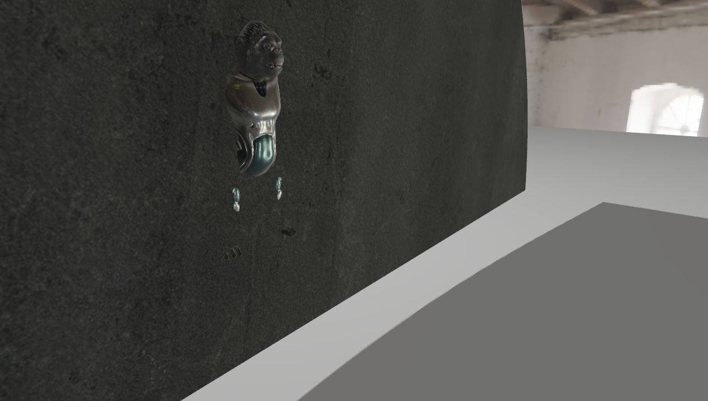

# toy-shader

## render result

## project framework

Assimp + glm + glfw + glad + Cmake

## Render framework

PBR BRDF + Image-base Ambient Light + Shadow Map + HDR Tone Mapping

## TODO

- Defferred Render
- SSAO
- Shadow Bias